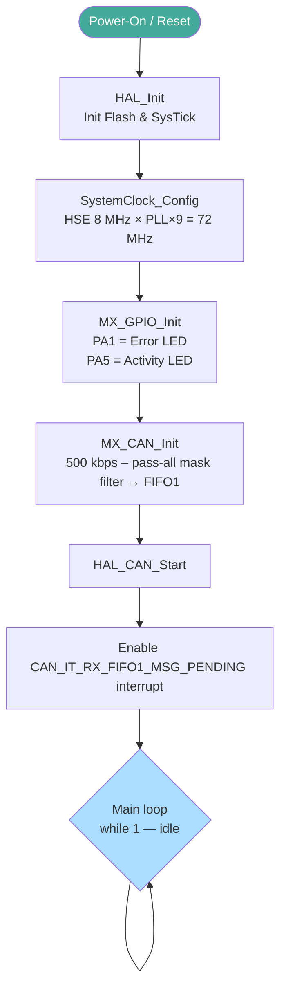
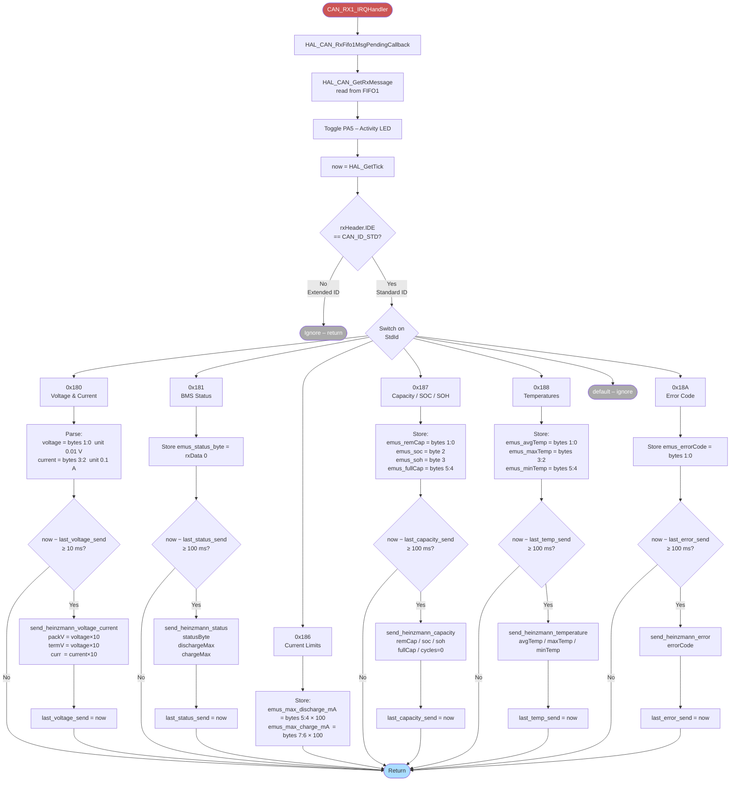
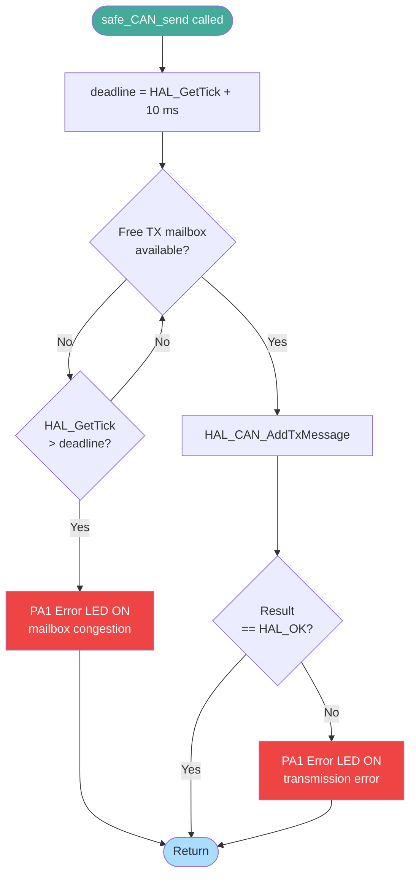
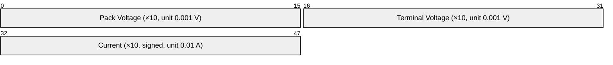
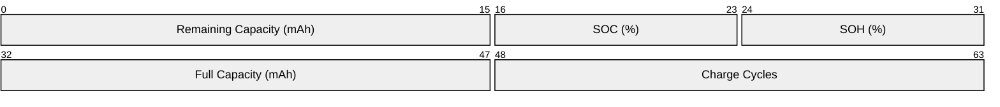
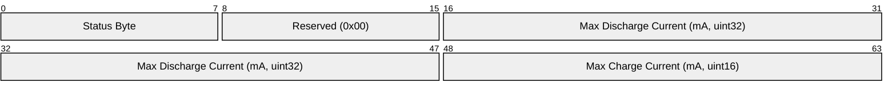
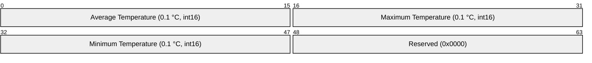
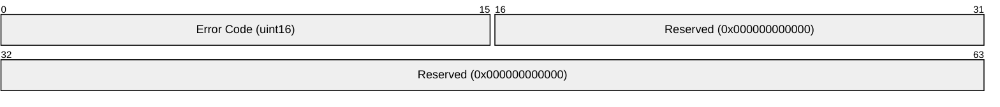
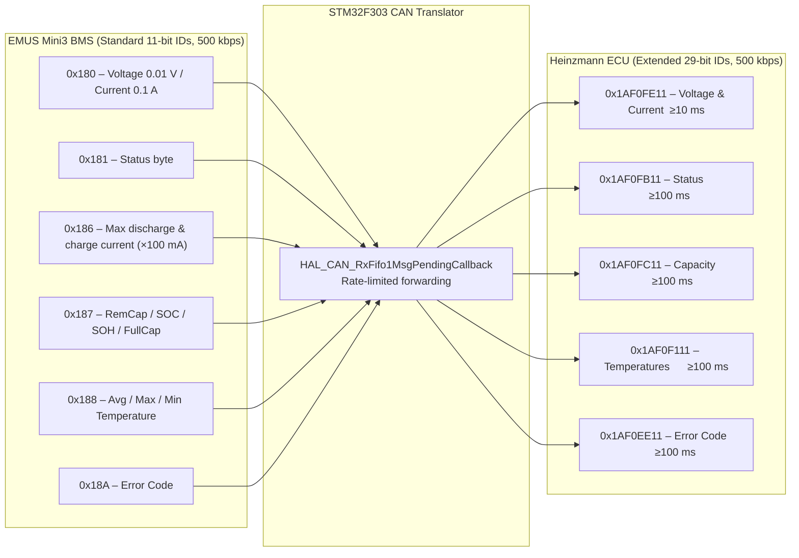

# CAN Translator – Software Flowcharts

These diagrams document the firmware running on the **Olimexino STM32F303RCTx**.  
The firmware translates CAN messages from the **EMUS Mini3 BMS** (standard 11-bit IDs)
to the **Heinzmann ECU** (extended 29-bit IDs) at **500 kbps**.

> **How to use in draw.io**  
> Open [draw.io](https://app.diagrams.net), choose *Extras → Edit Diagram*, select
> *Mermaid* from the format dropdown, and paste the code block of any diagram below.

---

## 1 – System Initialisation & Main Loop

---

## 2 – CAN Receive Interrupt & EMUS → Heinzmann Translation

This is the core translation logic. It fires every time an EMUS Mini3 BMS
message arrives on the CAN bus.

---

## 3 – safe_CAN_send (Guarded Transmission)

All five `send_heinzmann_*` functions route through this helper to prevent
mailbox overflows from locking up the ISR.

---

## 4 – Heinzmann Message Encoding

Each table shows how EMUS Mini3 BMS data is packed into the corresponding
Heinzmann extended-ID CAN frame.

### 4a – Voltage & Current  `0x1AF0FE11`  DLC=6

### 4b – Capacity / SOC / SOH  `0x1AF0FC11`  DLC=8

### 4c – BMS Status  `0x1AF0FB11`  DLC=8

### 4d – Temperatures  `0x1AF0F111`  DLC=8

### 4e – Error Code  `0x1AF0EE11`  DLC=8

---

## 5 – CAN ID & Scaling Reference

